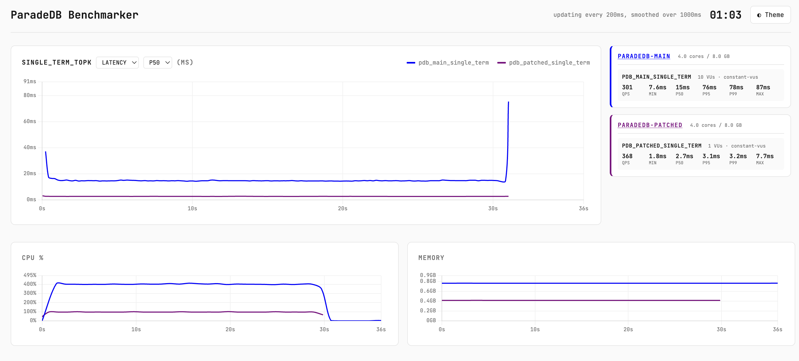

<h1 align="center">
  <br>
  ParadeDB Benchmarker
  <br>
</h1>

<p align="center">
  <b>Benchmark any database with k6. Real-time dashboard, consistent metrics, reproducible results.</b>
</p>

<h3 align="center">
  <a href="docs/scripting.md">Scripting Guide</a> &bull;
  <a href="docs/dashboard.md">Dashboard</a> &bull;
  <a href="docs/datasets.md">Datasets</a> &bull;
  <a href="docs/loader.md">Data Loader</a> &bull;
  <a href="docs/docker.md">Docker</a> &bull;
  <a href="CONTRIBUTING.md">Contributing</a>
</h3>

---

A [k6](https://grafana.com/docs/k6/latest/) extension for benchmarking databases with a unified API, real-time dashboard, and comprehensive data loading tools. While the included datasets focus on full-text search, the framework works for any query workload. You write the SQL or API calls, it handles timing, metrics, and visualization.

Compare performance across **ParadeDB**, **PostgreSQL FTS**, **Elasticsearch**, **OpenSearch**, **ClickHouse**, and **MongoDB Atlas Search** with consistent metrics and visualization. Docker Compose profiles are included for single-node benchmarking, but you can point at any database: local installs, remote servers, or cloud services.

We built this at [ParadeDB](https://paradedb.com) to drive our iterative performance improvement process and power our benchmarks. It's very early, but we hope it can help others get their TTFB (time to first benchmark) down. We'd ❤️ your help improving it, PRs welcome!



## How It Works

The benchmarker is built on [Grafana k6](https://grafana.com/docs/k6/latest/), an amazing load testing tool written in Go. You write a k6 JavaScript script that defines **scenarios** and **backends**. Each scenario specifies an executor (how load is generated), a duration, a number of virtual users (VUs), and which functions to run, using which backends. k6 spins up VUs as concurrent goroutines, each looping over your test function for the duration of the scenario.

This project extends k6 with the `k6/x/database` module, adding backend drivers, automatic metrics, a real-time dashboard, and an export format on top.

### Composing tests

A single script can compose multiple scenarios across multiple backends. You might run queries against ParadeDB for 30 seconds, then against Elasticsearch for 30 seconds, with a built-in phase timer staggering them so they don't compete for system resources. Within each phase you can layer different workloads: a full-text search at 200 QPS, an aggregation query at 100 QPS, and a 1,000 row/s ingest stream, all running concurrently. The framework times every operation, tags it with the backend name, and pushes metrics to the dashboard automatically.

While the framework exposes many backends, it's up to the user to write the queries to test (in JSON or SQL). A user can expect that the *way* the queries are run is optimal, but must still make sure the content of the queries is sane.

### Ingest & update workloads

In addition to queries, you can run concurrent ingest (insert) and update workloads. The primary purpose is to put write pressure on the database while queries are running, measuring how query latency degrades under a realistic mixed workload. This is more meaningful than comparing raw ingest or update throughput across backends, since each database handles write consistency, indexing, and flush semantics differently.

### Load strategies

k6 gives you several strategies for generating load:

- **`constant-vus`**: fixed number of users hammering queries in a loop. The simplest way to measure throughput and latency.
- **`ramping-vus`**: gradually increases concurrency over stages, letting you find the point where latencies spike or errors appear.
- **`constant-arrival-rate`**: fixed number of requests per second regardless of response time. Useful for SLA testing or measuring ingest at a target throughput.

You can mix these freely across scenarios in the same script.

### Dashboard

Results stream to a browser in real-time: latency percentiles (P50/P90/P95/P99), queries per second, ingest rate, and Docker container CPU/memory per backend. The dashboard also captures backend configs, setup scripts, and query patterns so results can be understood and reproduced later. Export as standalone HTML to share.

## Quick Start

### 1. Build

```bash
make
```

### 2. Start backends

The included `docker-compose.yml` uses profiles, which provide an easy way to only spin up a subset of containers.

Please note the 'sample' dataset which is included does not provide a meaningful benchmark, it's designed to show how to use the system.

```bash
docker compose --profile paradedb --profile postgresfts up -d
```

See [Docker Setup](docs/docker.md) for all available profiles and services.

### 3. Load data

```bash
./bin/loader load --backend paradedb ./datasets/sample
```

See [Data Loader](docs/loader.md) for advanced options like custom connection strings, parallel workers and S3 pulls.

### 4. Run a benchmark

```bash
./k6 run --out dashboard datasets/sample/k6/simple.js
```

Open http://localhost:5665/static/ to see real-time results. See [Dashboard](docs/dashboard.md) for export and replay options.

## Writing Scripts

Scripts are standard k6 JavaScript with the `k6/x/database` extension. Here's a minimal example that benchmarks ParadeDB with 5 concurrent users for 30 seconds:

```javascript
import db from "k6/x/database";

// Connect to the paradedb container using the standard settings from docker-compose
const backends = db.backends({ backends: ["paradedb"] });

// Open a file which has a termset we can use to customise queries
const terms = db.terms(open("./search_terms.json"));

// Define the scenarios to run
const scenarios = {
  paradedb: {
    executor: "constant-vus",
    vus: 5,
    duration: "30s",
    exec: "paradedbQuery",
  },
};

// Add docker based metric collection
backends.addDockerMetricsCollector(scenarios, "35s");
export function collectMetrics() { backends.collect(); }

export const options = { scenarios };

// Create the function which k6 will call on each iteration
export function paradedbQuery() {

// Activate the paradedb backend and run the query, cycling through the items in terms
  backends.get("paradedb").query(
    `SELECT id, title FROM documents WHERE content ||| $1 LIMIT 10`,
    terms.next(),
  );
}
```

Each VU runs the `paradedbQuery` function in a loop for 30 seconds. The framework times every call, records the hit count, and pushes metrics to the dashboard. Swap `"constant-vus"` for `"ramping-vus"` to ramp load up and down, or `"constant-arrival-rate"` to send a fixed number of requests per second.

The [Scripting Guide](docs/scripting.md) covers the full module API, backend configuration, multi-backend comparisons with phase timing, ingest/update benchmarks, and query examples for every supported backend.

## Documentation

| Guide | Description |
| --- | --- |
| [Scripting Guide](docs/scripting.md) | Module API, backend config, benchmark patterns, query reference |
| [Dashboard](docs/dashboard.md) | Real-time UI, metrics reference, export & replay |
| [Datasets](docs/datasets.md) | Directory structure, schema format, pre/post scripts |
| [Data Loader](docs/loader.md) | CLI usage, connection strings, S3 pulls |
| [Docker Setup](docs/docker.md) | Compose profiles, service ports, TLS |
| [Contributing](CONTRIBUTING.md) | Adding backends, development setup, PR workflow |

## License

MIT License - see [LICENSE](LICENSE) for details.
